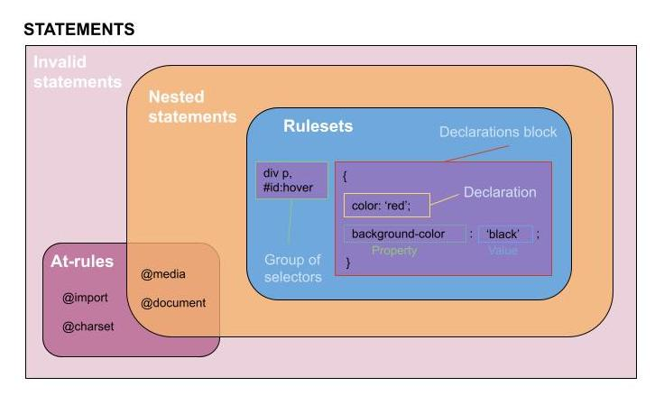

# Notas Masterclass HTML
## CSS

### Sintaxis

Esta es una vista más completa de todas las partes de CSS: 

### Selectores

Existen muchos más selectores que están especificados en modulo de Selectores de CSS. Este estándar es muy técnico y está escrito en inglés. No es recomendado para desarrolladores comunes. Está creado para desarrollares que trabajan en navegadores, pero es la fuente de la verdad cuando busques de donde vienen todos los selectores:

https://drafts.csswg.org/selectors-3/#selector

Ejemplos de estos otro selectores son:      

``*`` selecciona todos los elementos

``p[title]`` selecciona todas las etiquetas p que tienen el atributo title

``p > div`` selecciona la etiqueta div que es hija de un a etiqueta p

``button:hover`` selecciona el botón cuando el cursor está sobre el botón

``div::after`` selecciona una etiqueta 'ficticia' que se crea después de elemento div

Vamos a ver ejemplos de otros selectores después en el curso.

### Cascada

El concepto de herencia tiene detalles adicionales que puedes leer más en este documento de Mozilla:

https://developer.mozilla.org/es/docs/Web/CSS/inheritance

### Especificidad

Aquí puedes ver un recurso interesante que te permite identificar el valor de la especificidad:

https://polypane.app/css-specificity-calculator/#selector=

### Unidades 

Existen muchas otras unidades que puedes revisar en este recurso de Mozilla:

https://developer.mozilla.org/en-US/docs/Learn/CSS/Building_blocks/Values_and_units

Cabe clarificar que cuando hablamos de la unidad de pixeles en CSS, esta no se refiere a un pixel real del monitor, sino es un pixel de referencia que visualmente puede verse del mismo tamaño en pantallas con diferentes resoluciones. Por esto es siempre una buena idea probar tu página web o aplicación en diferentes dispositivos para ver cómo se comporta.

Aquí también dejo un artículo que habla de si deberíamos dejar de utilizar la unidad de pixeles porque no es muy flexible. Hay muchos temas que son debatidos en esta industria. Lo que hoy es una buena práctica puede cambiar el día de mañana así que ten una mente abierta al cambio. Puedes dar un click derecho en Chrome para traducir el documento:

https://medium.com/@julienetienne/pixels-are-dead-faa87cd8c8b9