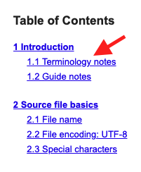
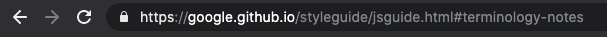

# Notas Masterclass HTML
##  Navegacion

### Vinculos

Un vínculo también se conoce como Link en Inglés.
Si el elemento `<a>` tiene un atributo href, entonces representa un hipervínculo.
Al dar un click en este hipervínculo podemos ir a otra página.
`<a href="https://www.google.com">Google</a>`

También podríamos ir a una sección en la misma página.
`<a href="#sección-en-mi-página">Sección</a>`

Las direcciones como https://www.google.com se llaman URL.
URL viene de Unified Resource Locator (Localizador de Recursos Uniforme)
Es la dirección en donde se encuentra un recurso.

Puedes leer más en Wikipedia:
https://es.wikipedia.org/wiki/Localizador_de_recursos_uniforme
`<a>` también es una etiqueta de texto semántico en el estándar de HTML:
https://html.spec.whatwg.org/multipage/text-level-semantics.html

### Rutas

- Ruta absoluta

Ubicación en un sistema de archivos en relación con el directorio raíz.

> Ejemplos:
> https://www.google.com
> `/img` (Se refiere a la carpeta img en mi página)

- Ruta relativa

Ubicación específica en un sistema de archivos en relación con el directorio actual en el que estamos trabajando.
> Ejemplos:
> ``../index.html`` (archivo index.html en la carpeta +padre de mi archivo actual)
> ``./index.html`` (archivo index.html en la misma carpeta de mi archivo actual)

### Navegacion
 
***Este es un ejemplo tutorial para ver la navegación de una pagina***

Esta es la dirección de la página de buenas prácticas de Javascript de Google:

https://google.github.io/styleguide/jsguide.html

No te preocupes del contenido pero nota que simplemente es un archivo de HTML.

Abre este recurso en tu navegador y da un click en los vínculos superiores.

Nota que estos llevan a secciones en la misma página.

Nota cómo cambia el URL en la parte superior de tu navegador.

Inspecciona el HTML en tu navegador para ver cómo está creado este HTML.

Click Derecho en la página > Inspect > Elements

Ahora puedes ver claramente el HTML que escribieron los Ingenieros de Google.

### Barras

***Este es un ejemplo de una barra de navegación en una página web:***

Cuando aprendas CSS vas a poder dar estilos y colores a tu HTML como este ejemplo.

El elemento `<nav>` es un elemento para crear secciones. Puedes ver más sobre secciones en el estándar de HTML y vamos a ver más elementos para secciones en otros videos.

https://html.spec.whatwg.org/multipage/sections.html

Roles
arial-label
Moverse de forma interna entre carpetas
ruta absoluta
ruta relativa
